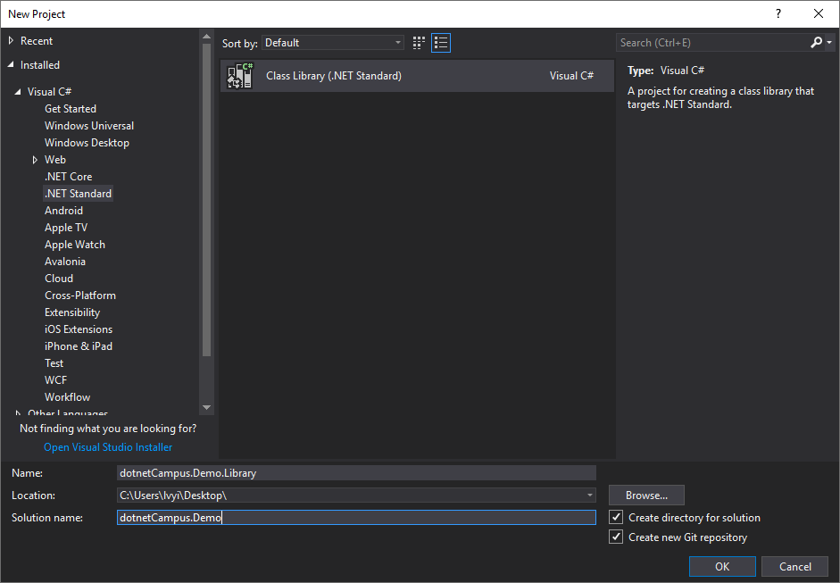

# 入门

源码包的使用分为两个部分：

1. 源码包打包
1. 安装和使用源码包

## 源码包打包

我们现在从零开始创建一个项目，然后将其打包成源码包。

### 第一步：新建一个项目，或者打开现有项目

创建项目是 Visual Studio 开发的必备步骤，所以这里只做简单描述。



在项目中，我们只新建一个简单的类型 `Foo` 用来演示：

```csharp
using System;

namespace dotnetCampus.Demo.Library
{
    /// <summary>
    /// This class is packaged as a source reference so it will be compiled into your own project.
    /// </summary>
    public class Foo
    {
        /// <summary>
        /// Print hello to the specifed <paramref name="name"/>.
        /// </summary>
        /// <param name="name">The name which <see cref="Foo"/> will say hello to.</param>
        public void PrintHello(string name)
        {
            Console.WriteLine($"Hello {name}");
        }
    }
}
```

项目中其实也只有这一个类而已：

```
- dotnetCampus.Demo.Library.csproj
- Foo.cs
```

## 安装和使用源代码打包

可以通过命令行或 VisualStudio 的 NuGet 管理器安装 [SourceYard](https://www.nuget.org/packages/dotnetCampus.SourceYard)

在安装完成之后，不需要任何配置，请右击项目进行编译

编译完成可以在输出路径，如 `bin\debug` 看到 `dotnetCampus.Demo.Library.Source.1.0.0.nupkg` 源代码包

## 使用源码包

再次新建或打开一个项目，接下来演示在这个项目安装和使用上一步打出来的源代码包

先在 VisualStudio 设置 NuGet 添加 `dotnetCampus.Demo.Library.Source.1.0.0.nupkg` 所在的文件夹

此时就可以在项目里面通过 NuGet 安装 dotnetCampus.Demo.Library.Source 库

尝试在新打开的项目里面使用 `dotnetCampus.Demo.Library.Foo` 方法

```csharp
            var foo = new dotnetCampus.Demo.Library.Foo();
            foo.PrintHello("dotnet campus");
```

尝试运行项目，将发现可以执行到 PrintHello 方法，同时支持断点调试到方法里面代码

打开项目的输出文件夹，可以看到在文件夹里面不存在 `dotnetCampus.Demo.Library.dll` 因为此时源代码包是作为源代码引用

例子用到的源代码参见 [sample](../../sample/App)